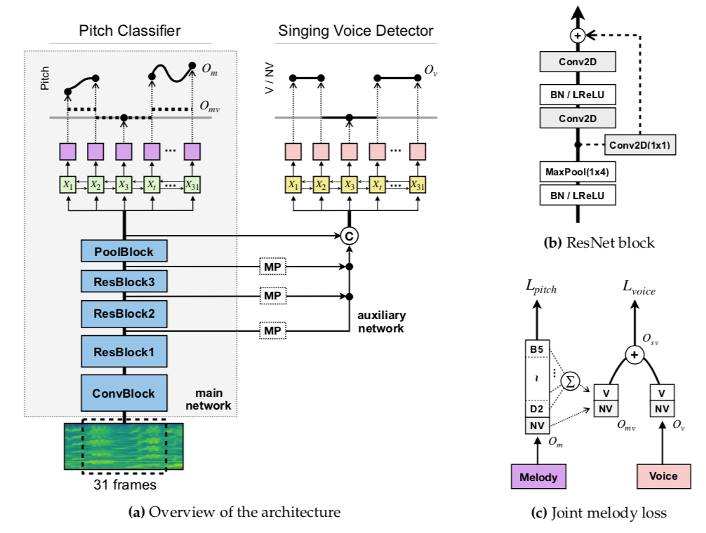

# Melody extraction using joint detection and classification network
The source code of *"Joint Detection and Classification of Singing Voice Melody Using Convolutional Recurrent Neural Networks"*, Applied Sciences (2019) |<a href = "https://www.mdpi.com/2076-3417/9/7/1324" target="_blank">PDF</a>|


## Abstract

We present a joint detection and classification (JDC) network that conducts the singing voice detection and pitch estimation simultaneously. The JDC network is composed of the main network that predicts the pitch contours of the singing melody and an auxiliary network that facilitates the detection of the singing voice. 



The main network is built with a convolutional recurrent neural network with residual connections and predicts pitch labels that cover the vocal range with a high resolution as well as non-voice status. 
The auxiliary network is trained to detect the singing voice using multi-level features shared from the main network. The two optimizations processed are tied with a joint melody loss function. 

We evaluate the proposed model on multiple melody extraction and vocal detection datasets, including cross-dataset evaluation. 
The experiments demonstrate how the auxiliary network and the joint melody loss function improve melody extraction performance. Also, the results show that our method outperforms state-of-the-art algorithms on the datasets.


## Dependencies

- OS: LINUX 

- Programming language: Python 3.6+

- Python Library 
  - Keras 2.2.2 (Deep Learning library)
  - Librosa 0.6.2 (for STFT)  
  - madmom 0.16.1 (for loading audio and resampling)
  - Numpy, SciPy

-  Hardware
  -  2 GPU : GeForce GTX 1080ti
  
## Using melody_extraction_JDC from the command line
``` 
$ python melodyExtraction_JDC.py -p ./test_audio_file.mp4 -gpu 0 -o ./output/

[optional arguments]
  -p filepath             Path to input audio(.wav) (default: ./test_audio_file.mp4)
  -gpu gpu_index          Assign a gpu index for processing.
                          It will run with cpu if None. (default: 0)
  -o output_dir           Path to output folder (default: ./output/)
```

- The resulting 'pitch_(*file_name*).txt' contains 2 columns: 
  - the first : timestamps (10 ms)
  - the second : the predicted fundamental frequency in Hz

```
0.08 0.0000
0.09 0.0000
0.10 0.0000
0.11 0.0000
0.12 182.3449
0.13 182.3449
0.14 183.6663
0.15 185.6663
0.16 187.0117
0.17 188.3669
```


